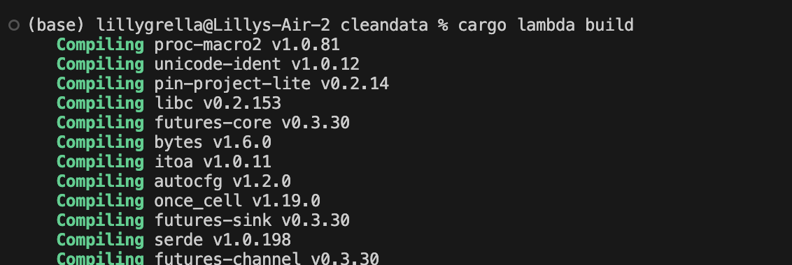

# Individual Project 4: Rust AWS Lambda and Step Functions
This project creates two lambda functions and combines them into a workflow using AWS Step functions.

# AWS Lambda Function
### Overview 
* For this assignment, I assume the lambda function receives a list of names. 
* The processing performed: Confirm names are capitalized and count how many names are in the list

### Create a lambda function for each processing step
* Start by running `cargo lambda new {functionname}` for each lambda function you plan to create (2 in this project's case)
* Implement functionality inside the main.rs file (make sure to include any dependencies in the Cargo.toml file)

### Test Lambda Functions
* Move inside the first lambda function: `cd {functionname}`
* Run `cargo lambda watch` to run a local version of the lambda function
* In a separate terminal, run `cargo lambda invoke --data-file ./data.json`
  * Confirm that the filepath to your test json is correct
* Check the output and make sure it is what's expected
* Repeat this process for the other lambda function 

### Build and Deploy Lambda Function to AWS
* Run `cargo lambda build` to build lambda function
* Run `cargo lambda deploy --region us-east-1` to deploy Lambda function to AWS
* Confirm in AWS console, under lambda functions, that the functions are there
* You are able to test the functions there as well to confirm deployment is successful

# AWS Step Functions
### Overview
* Now that we have lambda functions prepped and ready, we can set up step functions to run them in a particular way

### Set-Up
* Navigate to the Step Functions Page on the AWS Console
* Create new State Machine

### Create, Test, and Run Workflow
* Either use the GUI or code and create the workflow however it is intended
* Test workflow by clicking `Test State`
* Once you are ready, click create
* `Start Execution` will run the state machine with given input

# Screenshots

## Building and Deploying Lambda Function 

### Capitalization Lambda Function

### Counting Lambda Function

### Lambdas in AWS

  
### Testing Lambdas: Two Styles

## Step Function

  
